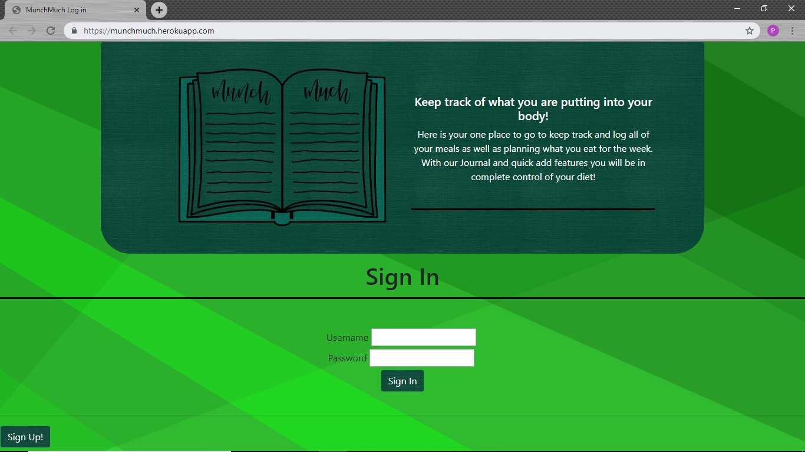
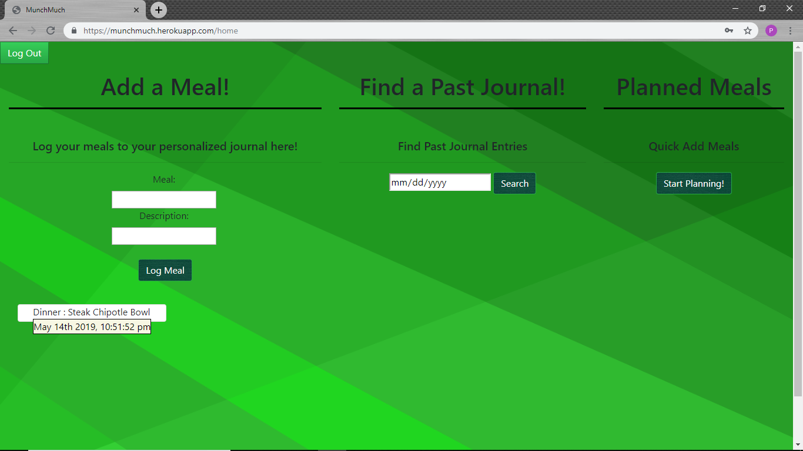

# Munch Much?
Munch Much is a Meal Journal Node Application that allows users to log what they eat when they eat it! It was built using the Express Framework as well as the following technologies..
 -MySQL
 -Passport
 -Sequelize

 ## What is Munch Much?
 At it's core, Munch Much is a web based Food Journal that allows users to log meals, snacks, or drinks! When a new meal is logged it is saved with a timestamp that you can use to recall past journal entries based on date!

 ### How do I Start Journaling?
 For new users, click on the signup button, select a unique username and a password and you are all set! Any journal entries will be associated with your Account!

 

 #### Why is There 2 Journals?
 When you log in, you will be met with two journals. The left journal is Today's entries while the journal on the right will remain empty untill you search for journal entries from a specific date. Once a date is submitted the Past Log will populate with journal entries from that day!
 